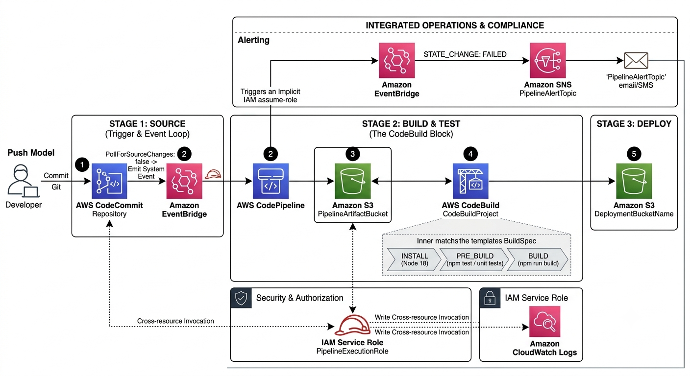

# End to End CI/CD Pipeline
A CloudFormation template that will create a CodePipeline to deploy a static website to s3. It includes CodeBuild as well as EventBridge driven alerts.

## Parameters
- Environment (dev, staging, prod)
- RepositoryName - this is an existing CodeCommit repo that will be used as the source.
- BranchName - the specific branch to monitor for changes (main is default)
- DeploymentBucketName - pre-existing S3 bucket where the web assets will be deployed to

## Features
### EventBridge rules over polling
The CodePipeline sets `PollForSourceChanges: 'false'`. This prevents AWS running api scanners to check if anything has changed on the repo. Instead it relies on an EventBridge rule to pick up any new commits to the set repo and branch. The rule targets CodePipeline so there is an IAM role for EventBridge to start CodePipeline.

### EventBridge Drives alerts
Monitoring is decoupled from the build process. The `AWS::Events::Rule` will detect the system level state changes of the CodePipeline and trigger an alert via SNS if any fail.

### Decoupled Security Contexts
No sharing of role between CodePipeline and CodeBuild. Each has their own execution role with their own set of permissions. Standard least-privilege practice.
